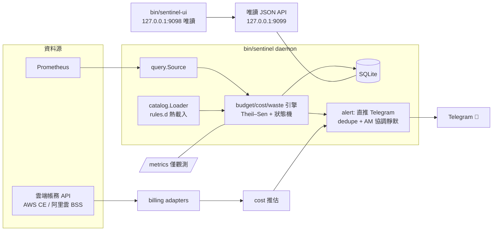

# 🔍 slo-sentinel

**前瞻預測式的 SRE 值班工具——在事故發生之前告訴你。**

監控系統擅長回答「現在壞了嗎」，但答不了「照目前的速度，什麼時候會壞」。slo-sentinel
輪詢 Prometheus，對任何有天花板的消耗型指標做多視野趨勢外插，提前以 Telegram
人話卡警告維護者：預算快燒穿、磁碟幾小時後滿、配額即將觸頂。

## Overview

傳統閾值告警是反應式的：等指數越線才響，此時通常已在影響使用者。slo-sentinel
補上**前瞻層**：

| 感測家族 | 問題 | 範例輸出 |
|---|---|---|
| SLO 預算燃盡 | error budget 還能撐多久？ | 「若持續爆量約 X 小時後燒穿；若回常態尚餘 Y 天」 |
| 容量觸頂 | 磁碟/連線/quota 幾小時後滿？ | 同上（雙視野並陳） |
| 成本推估 | 本月帳單會到多少？ | 月底推估＋預算燒穿 ETA＋爆衝偵測 |
| 瘦身閒置 | 哪些 ELB/K8s 資源是殭屍？ | 候選清單＋累積浪費金額 |

核心演算法：**Theil–Sen 穩健斜率**（抗脈衝）＋**激進/穩健雙視野 ETA**（拒絕被
一次性尖峰誤導的單窗線性外插）。詳細公式見任務書附錄 `algs/capacity-eta.md`。

設計立場：**通知一律直推人類，不自動執行任何修復動作**；AlertManager 的靜態
告警若已 firing，sentinel 自動靜默避免雙重轟炸（F2b 協調機制）。

## Features

- **多視野 ETA 引擎**：Theil–Sen 斜率＋激進/穩健雙視野並陳；採樣有效性校驗
  （最少樣本數、缺口剔除、天花板跳變清快取）；解除遲滯（連續 2 輪詢才降級）
- **四個感測家族**：
  - SLO 預算燃盡（相容 Sloth 生成的 recording rules）
  - 容量觸頂（`capacity_defs/*.yaml` 宣告式定義，天花板可為動態查詢）
  - 成本推估（AWS Cost Explorer / AlibabaCloud BSS adapter，月底推估＋爆衝偵測）
  - 瘦身閒置（ELB 零流量、K8s/OpenShift 過度請求容器與孤兒 PVC、Standalone 殭屍主機）
- **感測目錄**：以標準 Prometheus rules 格式為基底，支援熱載入、上游同步
  （awesome-prometheus-alerts）、失敗整檔隔離
- **直推通知**：Telegram 人話卡（雙視野並陳）、狀態流轉去重、每日摘要、
  AlertManager 協調靜默
- **唯讀 Web UI**：總表／感測詳情（預測 vs 實際）／命中統計／成本／瘦身影候選
- **CLI**：`sentinel status` 現況表

## Architecture



## Project Structure

```
cmd/sentinel/       daemon 進入點＋status 子命令＋主迴圈＋唯讀 API/metrics
cmd/sentinel-ui/    唯讀網頁（五張頁面，GET-only）
config/             全域設定載入
internal/
├── spec/           SLO 定義解析（OpenSLO 子集）
├── query/          Prometheus Source 介面＋HTTP 實作＋Fake
├── catalog/        rules.d 感測目錄（promtool 驗證/fsnotify 熱載入/分類路由）
├── budget/         ★ 多視野 ETA 引擎（Theil–Sen/有效性校驗/狀態機）
├── capacity/       容量感測引擎（capacity_defs 解析＋Sensor.Poll）
├── billing/        帳務 adapter（AWS CE SigV4 / 阿里雲 BSS HMAC）
├── cost/           成本推估與報表
├── pricing/        公開價目表目錄（AWS Query/Bulk API＋阿里雲 SKU；estimate 模式主路徑）
├── waste/          瘦身掃描器＋tracker（cloud/k8s/standalone providers）
├── alert/          Telegram 直推/dedupe/AM 協調/每日摘要
└── store/          SQLite 狀態與預測紀錄（WAL）
docs/               部署文件＋freeze-policy 範本
deploy/docker/      容器設定範本（sentinel.yaml / sentinel-ui.json）＋ entrypoint.sh
algs/               （任務書側）演算法規格
scripts/            sync-community.sh（社群規則挑選式同步）
cmd/ruleclassify/   社群規則自動分類 CLI（sync 後處理）
Dockerfile          多階段建置（golang:alpine → alpine:latest，非 root）
docker-compose.yml  daemon + UI 兩服務編排（healthcheck/資料卷）
```

## Requirements

- Runtime: Go 1.26+（建置）；執行期為靜態 binary，無 CGO 依賴
- Prometheus（指標源；waste 家族依賴 node_exporter / kube-state-metrics / 雲供應商指標）
- AlertManager（選配：F2b 協調靜默查詢用）
- promtool（選配：rules.d 語法驗證）

## Installation

```bash
git clone https://github.com/gentoobreaking/slo-sentinel.git
cd slo-sentinel
make build   # 產出 bin/sentinel bin/sentinel-ui
```

### Docker（alpine base，多階段建置）

```bash
make docker-up      # 建置映像並啟動 daemon + UI（docker compose up -d --build）
make docker-down    # 停止（SQLite/快取保留在 named volume）
make docker-build   # 只建置映像 slo-sentinel:latest
make docker-logs    # 追蹤兩個服務的日誌
```

**映像設計**：多階段建置——`golang:alpine` 靜態編譯（`CGO_ENABLED=0`，
SQLite 走純 Go 的 modernc.org/sqlite）→ `alpine:latest` 執行層；
以非 root 用戶 `sentinel` 執行（entrypoint 先修正資料卷權限再 `su-exec` 降權）；
內建 `promtool` 供 rules.d 語法驗證。兩個服務共用同一映像，以 entrypoint/command 切換。

**服務與連接埠**：

| 容器 | 說明 | 連接埠（宿主端預設僅綁本機） |
|---|---|---|
| `sentinel` | daemon＋唯讀 JSON API＋metrics | `127.0.0.1:9099`（API）、`127.0.0.1:9102`（metrics） |
| `sentinel-ui` | 唯讀網頁（反向代理 sentinel API） | `127.0.0.1:9098`——對外務必置於反向代理認證之後 |

**掛載點**：

| 容器路徑 | 來源 | 權限 |
|---|---|---|
| `/etc/sentinel/sentinel.yaml` | `deploy/docker/sentinel.yaml` | ro |
| `/etc/sentinel/sentinel-ui.json`（UI 容器） | `deploy/docker/sentinel-ui.json` | ro |
| `/srv/sentinel/rules.d`、`/srv/sentinel/slo_defs`、`/srv/sentinel/capacity_defs` | repo 對應目錄 | ro（rules.d 支援熱載入） |
| `/var/lib/sentinel` | named volume `sentinel-data` | rw（SQLite WAL＋pricing 快取） |

**環境變數**（見 `docker-compose.yml`）：`TELEGRAM_CHAT_ID`、
AWS／阿里雲金鑰（actual 成本模式）、`SENTINEL_COST_MAP`（estimate 模式映射檔）、
`PRICING_CACHE_DIR`（容器內已預設指向資料卷）。敏感資訊一律走環境變數或 secrets，勿寫進映像。

**Healthcheck**：daemon 打自身 `GET /api/status.json`；UI 打自身首頁——
compose 已為各服務覆寫，不會互相誤判。`depends_on: condition: service_healthy`
確保 UI 等 daemon 就緒才啟動。

> 注意：本機 `~/.docker` 受 macOS 權限保護時，buildx 可能報
> `operation not permitted`；此時可用 `DOCKER_BUILDKIT=0 make docker-build`
> （legacy builder，同樣支援多階段建置）。

## Configuration

`sentinel -config sentinel.yaml`（留空使用全預設值）。範本見
[`docs/sentinel.yaml.example`](docs/sentinel.yaml.example)：

| 鍵 | 預設 | 說明 |
|---|---|---|
| `poll_interval_sec` | `60` | 主輪詢間隔 |
| `prometheus_url` | `http://localhost:9090` | 指標源 |
| `alertmanager_url` | `http://localhost:9093` | F2b 靜默協調查詢 |
| `telegram_token` | — | 未設定時通知降級為 log-only |
| `rules_dir` | `rules.d` | 感測目錄（熱載入） |
| `capacity_defs_dir` | `capacity_defs` | 容量感測定義 |
| `db_path` | `sentinel.db` | SQLite（WAL）；相對路徑相對工作目錄，絕對路徑照用（容器部署必需） |
| `listen_addr` | `127.0.0.1:9099` | 唯讀 JSON API——勿對外公開 |
| `metrics_addr` | `127.0.0.1:9102` | Prometheus scrape 目標 |
| `log_format` | `json` | json / text |
| `waste_scan_interval_sec` | `21600` | waste 掃描週期秒數；`0` 完全停用（T024，亦可用環境變數覆寫） |

環境變數：

| 變數 | 用途 |
|---|---|
| `TELEGRAM_CHAT_ID` | 推播目標聊天室 |
| `REDIS_STREAM_MAXLEN` | （worker 相關）串流長度上限 |
| `AWS_ACCESS_KEY_ID` / `AWS_SECRET_ACCESS_KEY` / `AWS_REGION` | 設定後啟用 AWS 成本感測 |
| `ALICLOUD_ACCESS_KEY_ID` / `ALICLOUD_ACCESS_KEY_SECRET` | 設定後啟用阿里雲成本感測 |
| `WASTE_SCAN_INTERVAL_SEC` | 覆寫 waste 掃描週期秒數；`off` / `0` 停用（T024） |

凍結政策（成本約束行為）由 [`docs/freeze-policy.example.yaml`](docs/freeze-policy.example.yaml)
定義——修改須走 git 審查，「團隊明文同意」即該檔變更被 approve 的事實。

## Quick Start

```bash
# 1. 定義一個容量感測
cat > capacity_defs/disk.yaml <<'EOF'
sensors:
  - id: data-disk
    metric:
      value:   'node_filesystem_avail_bytes{mountpoint="/data"}'
      ceiling: 'node_filesystem_size_bytes{mountpoint="/data"}'
EOF

# 2. 匯出一組感測目錄規則（可先空目錄起步）
mkdir -p rules.d && touch rules.d/.keep

# 3. 啟動（Telegram token 未設定時通知走 stdout log，方便先驗證管線）
./bin/sentinel -config sentinel.yaml

# 4. 另開終端看總表
./bin/sentinel-ui -config ui.json &     # ui.json: {"sentinel_api":"http://127.0.0.1:9099"}
open http://127.0.0.1:9098
```

## Usage

```bash
./bin/sentinel                    # daemon 模式（預設）
./bin/sentinel status             # 列出所有感測現況表
./bin/sentinel status -db other.db
./bin/sentinel-ui                 # 唯讀網頁（GET-only）
```

Web 頁面：`/` 總表｜`/slo/{id}` 詳情與預測歷史｜`/accuracy` 命中統計｜
`/cost` 成本推估｜`/waste` 瘦身影候選。全部唯讀（僅 GET），預設綁
127.0.0.1——對外暴露請置於反向代理認證之後。

## Testing

```bash
go test ./...      # 100 個測試函式、14 套件，全離線可跑：單元/契約/煙霧測試
make vet           # go vet
make build         # 產出 bin/ 並於 CI 驗證 ≤20MB
```

### 端到端測試環境（dev profile）

用 compose 內建的 Prometheus＋node_exporter 餵**真實主機資料**給 sentinel，
一鍵驗證「指標 → 容量感測 → ETA 引擎 → 唯讀 API → CD 閘門腳本」整條鏈：

```bash
docker compose --profile dev up -d --build
```

啟動的五個容器：`slo-sentinel`、`slo-sentinel-ui`、`slo-prometheus`（:9090）、
`slo-node-exporter`（:9100）、`slo-alertmanager`（:9093，F2b 協調靜默查詢用）。
相關檔案：

- `deploy/prometheus/prometheus-dev.yml`——Prometheus 設定（抓 node-exporter＋自我監控）
- `capacity_defs/node-disk.yaml`——真實磁碟感測 `dev-root-disk`
  （used = size − free；node_exporter 沒有 used_bytes 指標，需相減；
  fstype 過濾跨環境通用，容器 VM 內也適用）
- `slo_defs/example.yaml`——示例 SLO（錯誤預算燃盡感測 `node-exporter-up`）
- `rules.d/example-rules.yaml`——Prometheus rules 格式示例（含分類 label 說明）
- `deploy/prometheus/alertmanager-dev.yml`——AM 最小設定（只開 API 不外寄）

驗證步驟（等約 1 分鐘讓 Prometheus 抓到兩個樣本後）：

```bash
# 1. 感測狀態（應出現 dev-root-disk＝healthy，利用率為真實磁碟值）
curl -s http://127.0.0.1:9099/api/status.json | python3 -m json.tool

# 2. CD 閘門契約端點（remaining_budget 為真實磁碟餘量 %）
curl -s http://127.0.0.1:9099/api/budget-status/dev-root-disk | python3 -m json.tool

# 3. CD 閘門腳本對活體 stack（notify 模式：警告但 exit 0）
SENTINEL_URL=http://127.0.0.1:9099 SLO_ID=dev-root-disk \
  bash scripts/cd-budget-handler.sh; echo "exit=$?"
```

收尾：`docker compose --profile dev down`（資料卷保留）。
注意 capacity_defs **非熱載入**——改定義檔後需 `docker restart slo-sentinel`。

> 此環境同時是 T019/T021 前置條件「daemon 實際運行 ≥30 天累積 burn rate」
> 的運行載體：掛上 Telegram token 後放著跑即可開始累積數據。

### 社群告警規則接入（挑選式同步＋自動分類）

來源：[awesome-prometheus-alerts](https://github.com/samber/awesome-prometheus-alerts)
（940+ 條規則、90+ 服務）。不需要全拉——`SELECTED` 清單列你堆疊用得到的服務即可，
sync 腳本會**自動分類並補上 `sentinel_kind` 標籤**，使用者不必理解分類學：

```bash
printf 'redis\npostgresql\n' > rules.d/community/SELECTED   # 一行一個服務名，支援 # 註解
./scripts/sync-community.sh                                 # 拉＋複製＋自動分類
git diff && git commit                                      # 審查後生效
```

自動分類規則（[`cmd/ruleclassify`](cmd/ruleclassify)）：

| 特徵 | 判為 | 語意 |
|---|---|---|
| expr/labels 引用 `sloth[:_]` 指標 | `budget` | Sloth 生成的預算規則 |
| annotations 有 idle/unused/orphan…、天級 `_over_time` 回看窗、`for ≥ 7d` | `waste` | 慢性瘦身影候選，進 sentinel 掃描與通知生命週期 |
| 其餘 | 不加標籤（KindNone） | 反應式閾值 → 留給 Prometheus/AlertManager |

安全性：人工標籤一律不覆寫；引號內字串（如 `mode="idle"`）不誤判；
yaml.Node 原位改寫保留註解。上游完整快取在 `.community-upstream/`
（gitignore，位於載入路徑之外），只有 SELECTED 的服務會進入 `rules.d/community/`。

> 📖 **深度文件**：規則分類學見
> [`docs/rule-classification.md`](docs/rule-classification.md)；
> budget/capacity 引擎的判斷邏輯與資料流見
> [`docs/engine-budget-capacity.md`](docs/engine-budget-capacity.md)。

## Deployment

容器化部署（docker compose，daemon＋UI 兩服務、healthcheck、資料卷持久化）見上方
「Installation → Docker」；裸機/systemd 部署見 `docs/deploy.md`——含 systemd unit、
rules.d 佔建流程（Sloth 整合與社群規則挑選式同步，見上方
「Testing → 社群告警規則接入」）、Prometheus scrape job 設定說明。CI
（`.github/workflows/ci.yml`）涵蓋 vet/test/binary 大小檢查（≤20MB）。

**成本/預算 CD 閘門（F6 Phase 1，notify 模式）**：唯讀端點
`GET /api/budget-status/{slo_id}` 已上線；目標服務的 CI/CD 管線以
[`scripts/cd-budget-handler.sh`](scripts/cd-budget-handler.sh) 接入（三套 CI
範例見 [`docs/ci-budget-gate.md`](docs/ci-budget-gate.md)）。notify 模式
永不阻擋部署（fail-open）；enforce 阻擋為 T021，鎖在 30 天校準數據與政策審查後。

## Security

- 所有監聽預設綁 `127.0.0.1`；UI 僅 GET、無寫入端點
- Telegram token／雲端帳務金鑰皆自環境變數讀取，不入版控
- SQLite 檔案不對外暴露；UI 一律走 sentinel 唯讀 JSON API
- 凍結政策的變更走 git 審查（`docs/freeze-policy.example.yaml`）

不宣稱符合任何安全標準——上述為實際存在的機制。

## Limitations

- **通知排程未自動化**：每日摘要與每週成本報表的格式已實作，但 daemon 迴圈
  尚未加入定時觸發（待辦）
- **status 子命令欄位**：尚未包含規格 §3.3 的預算剩餘% 與 burn rate 欄
- **成本 adapter**：僅 unblended cost；RI/Savings Plans 攤銷、分層定價、
  即時匯率未支援；對真實雲端 API 的整合僅經 fake server 測試
  `[NEEDS VERIFICATION]`
- **waste 浪費金額**：候選清單的金額計算需 billing 單價對接，目前為 0
- **K8s 感測**：透過 kube-state-metrics/cAdvisor 指標驅動，非 client-go
- Windows 不支援（fsnotify/inotify 用法）

## Troubleshooting

| 症狀 | 原因與處理 |
|---|---|
| 啟動即印 `telegram_token 未設定：通知降級為 log-only` | 正常降級；填入 token 後重啟即恢復推播 |
| `promtool_not_found_rules_unvalidated` | 安裝 prometheus（含 promtool）以啟用規則驗證 |
| `rule_file_quarantined` | 該 rules 檔語法錯誤已被隔離；修正後存檔會自動重新載入 |
| UI 出現 `sentinel API 無法連線` | 確認 daemon 在跑且 listen_addr 與 ui config 的 sentinel_api 一致 |
| 預測一直不出現 | 採樣有效性校驗未過（§A.5）：冷啟動需累積至少 83% 樣本；天花板剛跳變也會重新累積 |

## Documentation

- [`docs/rule-classification.md`](docs/rule-classification.md) — 規則分類與使用指南（sentinel_kind 判定邏輯全解）
- [`docs/engine-budget-capacity.md`](docs/engine-budget-capacity.md) — 預算／容量引擎：判斷邏輯與完整資料流
- [`docs/ci-budget-gate.md`](docs/ci-budget-gate.md) — CD 閘門 CI 接入範例
- [`docs/deploy.md`](docs/deploy.md) — 部署指南
- [`docs/sentinel.yaml.example`](docs/sentinel.yaml.example) — 設定範本
- [`docs/freeze-policy.example.yaml`](docs/freeze-policy.example.yaml) — 凍結政策範本
- 演算法細節（Theil–Sen/雙視野/成本公式）見任務書側 `~/tasks/slo-sentinel/algs/`

## License

本專案採用 **Apache License 2.0** 授權，完整條款見 [`LICENSE`](LICENSE)。
